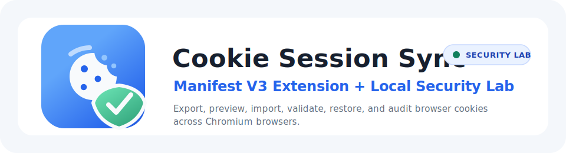

<p align="center">
  
</p>

<h1 align="center">Cookie Session Sync & Security Lab</h1>

<p align="center">
  A production-grade Manifest V3 Chrome extension for cookie export, preview, import, validation, restoration, and defensive client-side authentication review.
</p>

<p align="center">
  <a href="https://github.com/1SAMAY/Cookie-Sync/archive/refs/heads/main.zip">
    
  </a>
  <a href="https://github.com/1SAMAY/Cookie-Sync/releases/latest">
    
  </a>
  <a href="https://developer.chrome.com/docs/extensions/reference/manifest">
    
  </a>
</p>

## What It Does

Cookie Session Sync & Security Lab is a clean, framework-free browser extension built with pure HTML, CSS, and vanilla JavaScript. It helps authorized users move cookie data between Chromium-based browsers, inspect cookie state, and understand why insecure client-side state management is dangerous.

The project also includes a local Express security lab that intentionally demonstrates a vulnerable login flow. The lab is for education only and runs on `localhost:3000`.

## Features

- Export all cookies related to the active website.
- Preview cookies in formatted JSON or Netscape HTTP Cookie File format.
- Copy JSON or Netscape output to the clipboard with a safe fallback.
- Download cookie exports as `.json` or `.txt`.
- Import JSON cookie arrays or Netscape cookie files.
- Validate imported cookies before writing them.
- Report imported, verified, skipped, failed, duplicate, and invalid counts.
- Reload the active tab after successful import.
- Check the active page for client-side authentication risk signals.
- Demonstrate insecure client-side state management on a local-only vulnerable server.
- Works without React, Vue, Tailwind, jQuery, CDNs, build tools, inline scripts, or `eval()`.

## Browser Support

This extension is designed for Chromium-based browsers that support Manifest V3:

- Google Chrome
- Brave
- Microsoft Edge
- Opera
- Other Chromium-based browsers

## Project Structure

```text
.
├── assets/
│   └── logo.svg
├── icons/
│   ├── icon16.svg
│   ├── icon48.svg
│   └── icon128.svg
├── background.js
├── manifest.json
├── package.json
├── popup.css
├── popup.html
├── popup.js
├── server.js
└── utils.js
```

## Install The Extension

1. Download the repository ZIP or clone the repository.
2. Open Chrome or another Chromium browser.
3. Go to `chrome://extensions`.
4. Enable `Developer mode`.
5. Click `Load unpacked`.
6. Select the project folder.
7. Pin the extension from the browser toolbar.

## Export Cookies

1. Open the website whose cookies you want to export.
2. Open the extension popup.
3. Click `Export JSON` or `Export Netscape`.
4. Review the formatted preview.
5. Use `Copy JSON`, `Copy Netscape`, `Download JSON`, or `Download Netscape`.

## Import Cookies

1. Open the destination browser profile.
2. Visit the same website/domain first.
3. Open the extension popup.
4. Paste the JSON or Netscape cookie content into the import box.
5. Click `Paste & Import`.
6. Review the import status:
   - `imported`: Chrome accepted the cookie write.
   - `verified`: The extension read the cookie back after writing it.
   - `skipped`: The cookie was invalid or duplicated.
   - `failed`: Chrome rejected the cookie write.

If cookies import and verify successfully but the site still does not show the same logged-in page, the site probably depends on more than cookies.

## Why A Restored Session May Still Fail

Modern websites often protect sessions using more than browser cookies. A session may fail to restore if the site uses:

- Server-side session invalidation
- Device or browser fingerprint binding
- IP or location checks
- LocalStorage or IndexedDB state
- Service worker state
- CSRF tokens bound to server-side state
- Short-lived refresh/access token rotation
- Re-authentication requirements
- SameSite, partitioned cookie, or third-party cookie restrictions

The extension can copy and restore cookies, but it cannot force a server to accept an invalid, expired, device-bound, or revoked session.

## Auth Check

The `Auth Check` section performs a read-only review of the active page for risky client-side authentication signals, including:

- Auth-like cookies without `HttpOnly`
- Auth-like cookies missing `Secure`
- Weak or missing `SameSite`
- Auth-like values in `localStorage` or `sessionStorage`
- Simple role/login flags such as `isAdmin`, `role`, or `loggedIn`
- JWT-like or long token-like values stored in web storage
- Login UI and front-end route guard indicators

This checker does not bypass login pages, modify websites, or access protected data. It reports signals that a developer should investigate in an authorized security review.

## Local Security Lab

The included `server.js` file creates a deliberately vulnerable local Express app. It grants access to a dashboard when the browser sends:

```text
user_role=admin
```

That is intentionally insecure because the server trusts editable client-side state.

### Run The Lab

```bash
npm install
npm start
```

Then open:

```text
http://localhost:3000
```

Use the extension button `Simulate Client-Side Bypass` only on the local lab. It sets the local `user_role=admin` cookie and reloads the demo page so you can see why this architecture is broken.

## Security Model

The extension follows Manifest V3 practices:

- No inline JavaScript
- No `eval()`
- No external frameworks or CDNs
- Service worker for privileged cookie operations
- Sanitized preview rendering
- Centralized validation and error handling
- Clipboard fallback without alert dialogs
- Read-only auth surface checker

## Required Permissions

The extension requests:

- `cookies`: read and write cookies for export/import.
- `tabs`: identify and reload the active tab.
- `activeTab`: work with the active tab the user selected.
- `scripting`: run the read-only auth checker on the active page.
- `clipboardRead` and `clipboardWrite`: paste/import and copy/export cookie data.
- `<all_urls>` host permission: required because cookies can belong to any active website the user chooses.

## Defensive Use Only

This project is for:

- Personal browser profile migration
- Authorized development and QA testing
- Local security education
- Defensive review of applications you own or are allowed to test

Do not use it to access accounts, systems, or websites without authorization.

## Troubleshooting

### Import says verified, but I am still logged out

The site likely uses server-side session checks, token rotation, device binding, localStorage, IndexedDB, or re-authentication. Cookies alone are not always enough.

### Import says failed

The browser rejected one or more cookies. Common causes include invalid domain/path combinations, expired cookies, unsupported partition fields, secure cookies on HTTP pages, or browser policy restrictions.

### No cookies export

Make sure the active tab is an `http://` or `https://` page. Browser internal pages such as `chrome://extensions` do not expose site cookies.

### Clipboard paste fails

Paste the cookie content manually into the textarea and click `Paste & Import`.

## Development Checks

Run syntax checks:

```bash
node --check server.js
```

The extension files are plain ES modules and can be loaded directly by Chromium as an unpacked extension.

## License

Use this project responsibly for authorized work and local education.
